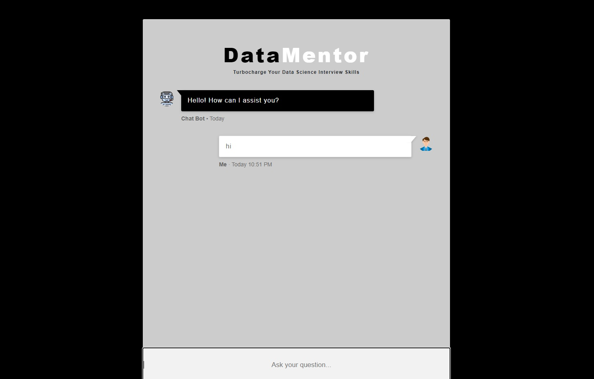

# DataMentor
<p>Turbocharge Your Data Science Interview Skills</p>


- Implemented an end-to-end Chatbot using the open-source model Mistral-7B-v0.1 from Hugging Face LLM provider. Initially, we acquired the model from Hugging Face and loaded it into a Jupyter notebook, leveraging a powerful 4-bit GPU.

- As LLMs inherently possess a substantial amount of data, we proceeded to further train the pretrained model on a domain-specific dataset. Personally, I provided the questions and answers from my own data science interview preparation file, which can be found within the dataset folder.

- Using QLoRa, we fine-tuned Mistral-7B-v0.1 on this domain-specific dataset, and you can refer to the attached experimentation notebook for more details.

- Subsequently, I designed an interactive User Interface using HTML, CSS, and Bootstrap expertise. The final step involved deploying the LLM on AWS through a CI/CD pipeline.

## Steps to Run it
### 1. Cloning the Repository
```bash
git clone https://github.com/MANMEET75/DataMentor.git
```
### 2. Creating the virtual environment using anaconda
```bash
conda create -p venv python=3.11 -y
```

### 3. Activate the virtual environment
```bash
conda activate venv/
```

### 4. Installing the dependencies
```bash
pip install -r requirements.txt
```


## 6. Check the DataMentor
```bash
python app.py
```

# AWS-CICD-Deployment-with-Github-Actions

## 1. Login to AWS console.

## 2. Create IAM user for deployment

	#with specific access

	1. EC2 access : It is virtual machine

	2. ECR: Elastic Container registry to save your docker image in aws


	#Description: About the deployment

	1. Build docker image of the source code

	2. Push your docker image to ECR

	3. Launch Your EC2 

	4. Pull Your image from ECR in EC2

	5. Lauch your docker image in EC2

	#Policy:

	1. AmazonEC2ContainerRegistryFullAccess

	2. AmazonEC2FullAccess

	
## 3. Create ECR repo to store/save docker image
    - Save the URI: 566373416292.dkr.ecr.ap-south-1.amazonaws.com/mlproj

	
## 4. Create EC2 machine (Ubuntu) 

## 5. Open EC2 and Install docker in EC2 Machine:
	
	
	#optinal

	sudo apt-get update -y

	sudo apt-get upgrade
	
	#required

	curl -fsSL https://get.docker.com -o get-docker.sh

	sudo sh get-docker.sh

	sudo usermod -aG docker ubuntu

	newgrp docker
	
# 6. Configure EC2 as self-hosted runner:
    setting>actions>runner>new self hosted runner> choose os> then run command one by one


# 7. Setup github secrets:

    AWS_ACCESS_KEY_ID=

    AWS_SECRET_ACCESS_KEY=

    AWS_REGION = us-east-1

    AWS_ECR_LOGIN_URI = demo>>  566373416292.dkr.ecr.ap-south-1.amazonaws.com

    ECR_REPOSITORY_NAME = simple-app

Enjoy Coding!

